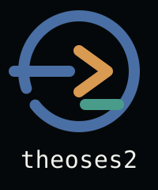

<p align="center">
  
</p>

<p align="center">
  <a href="https://www.npmjs.com/package/theoses-coding-agent"></a>
  <a href="LICENSE"></a>
  <a href="https://github.com/H4fizWasabie/theoses2/releases"></a>
</p>

# Theoses2

Theoses2 is a self-hosted, single-owner personal assistant and coding agent. It works in local projects from the terminal, while the same engine can also be reached through a private Telegram bot or browser dashboard.

The point is continuity: each channel keeps its own conversation and session history, while a shared durable memory can be queried explicitly across channels. Recent context stays bounded instead of growing without limit.

## What it does

- **Acts on real workspaces.** The CLI can read, write, edit, and run shell commands, then extend that toolset through extensions, HTTP sidecars, or MCP servers.
- **Keeps working context.** Sessions are persisted as JSONL and support resume, fork, branching, export, and compaction. Working Notes preserve short-lived orientation; semantic and episodic memory preserve durable facts.
- **Uses the model you choose.** `theoses-ai` provides a common streaming and tool-calling API across OpenAI, Anthropic, Google, OpenRouter, Bedrock, local OpenAI-compatible servers, and many other providers, including OAuth-backed subscriptions.
- **Adapts to your workflow.** Load `AGENTS.md` or `CLAUDE.md`, skills, prompt templates, themes, custom providers, and TypeScript extensions without changing the agent core.
- **Runs where you need it.** Use interactive, print, JSON, or RPC modes from the CLI, or embed sessions through the SDK.

## Channels

| Channel | Use | Status |
| --- | --- | --- |
| [Terminal CLI](packages/coding-agent) | Full interactive coding-agent experience | Primary |
| [Telegram](packages/telegram) | Owner-only remote conversations, files, and rich replies | Self-hosted |
| [Dashboard](packages/dashboard) | Browser chat, Telegram history, memory graph, and file workbench | Private, self-hosted |
| [Protocol / client / server](packages/protocol) | Transport-neutral framed CBOR sessions for other consumers | Experimental |

All first-party channels currently create sessions through the shared coding-agent runtime. The protocol, client, and server packages are an optional transport seam; they are not required to run the CLI, Telegram, or dashboard.

## Quick start

Requirements: Node.js 22.19 or newer.

Install the CLI:

```bash
npm install -g --ignore-scripts theoses-coding-agent
```

Choose a provider. For example:

```bash
export ANTHROPIC_API_KEY=sk-ant-...
```

Start Theoses from the project it should work on:

```bash
cd /path/to/project
theoses
```

Then ask it to inspect or change the project:

```text
Summarize this repository and tell me how to run its checks.
```

You can also run `/login` inside Theoses to authenticate with a supported subscription provider. See [Quickstart](packages/coding-agent/docs/quickstart.md) for provider setup, API-key storage, and platform notes.

For a one-shot task:

```bash
theoses -p "Review the error handling in src/"
```

## The runtime in one view

```text
Terminal CLI ─┐
Telegram ─────┼──> AgentSession / SessionManager ──> Agent loop + tools
Dashboard ────┘                 │                         │
                                ├── bounded channel context
                                ├── JSONL session history
                                ├── working notes + durable memory
                                └── model runtime ───────> theoses-ai providers
```

The agent runs with the permissions of the account that launched it. It does not include a built-in filesystem, process, network, or credential sandbox. Use a container, VM, Gondolin, or OpenShell when stronger isolation is required; see [containerization](packages/coding-agent/docs/containerization.md).

## Packages

| Package | Role |
| --- | --- |
| [theoses-coding-agent](packages/coding-agent) | CLI, session management, tools, skills, extensions, and SDK |
| [theoses-agent-core](packages/agent) | Stateful agent loop, tool execution, and event streaming |
| [theoses-ai](packages/ai) | Provider adapters, model discovery, auth, streaming, and usage tracking |
| [theoses-tui](packages/tui) | Terminal UI primitives and differential rendering |
| [theoses-telegram](packages/telegram) | Telegram channel integration |
| [theoses-dashboard](packages/dashboard) | Private browser dashboard and file workbench |
| [theoses-protocol](packages/protocol) | Validated CBOR schemas and byte-stream framing |
| [theoses-client](packages/client) | Transport-neutral remote-session client |
| [theoses-server](packages/server) | Experimental session server boundary |
| [theoses-telemetry](packages/telemetry) | Vendor-neutral telemetry contracts and typed schemas |

## Documentation

- [CLI quickstart](packages/coding-agent/docs/quickstart.md)
- [Daily usage and CLI reference](packages/coding-agent/docs/usage.md)
- [Providers and authentication](packages/coding-agent/docs/providers.md)
- [Skills](packages/coding-agent/docs/skills.md) and [extensions](packages/coding-agent/docs/extensions.md)
- [SDK](packages/coding-agent/docs/sdk.md)
- [Dashboard](packages/dashboard/README.md)
- [Security policy](SECURITY.md)
- [Contributing](CONTRIBUTING.md)

## Development

```bash
npm install --ignore-scripts
npm run build         # Refresh model data, then build all packages
npm run build:offline # Build with the checked-in model data snapshot
npm run check         # Formatting, lint, dependency, import, type, and smoke checks
./test.sh             # Repository test runner
```

The monorepo requires exact versions for direct external dependencies and keeps generated release artifacts out of normal development. Do not expose dashboard or Telegram credentials in URLs, source files, or logs.

## License

MIT
